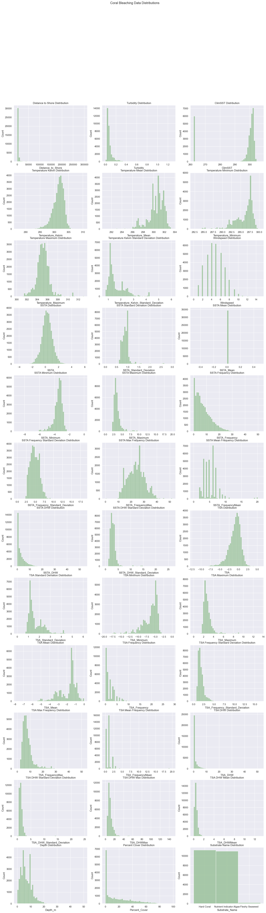
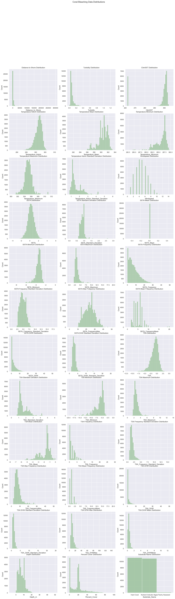

# Coral Bleaching
## Predicting the Likelihood and Severity of Coral Reef Bleaching Events Based on Various Environmental Factors

Authors: Jaimie Chin & Maro Aboelwafa  
Course: DS.UA.301 - Advanced Topics in Data Science: Machine Learning for Climate Change  
Date: 17 April 2023  

## Background
The climate issue we are tackling is predicting the likelihood and severity of coral reef bleaching events based on various environmental factors. Coral reefs are sensitive to environmental changes such as temperature, salinity, nutrient levels and water acidity. When these factors reach certain thresholds, they  trigger coral bleaching, a process in which the coral expels the symbiotic algae that live on it, causing the coral to turn white and possibly die.

To address this, we aim to use machine learning to analyze datasets of environmental data, such as water temperature to develop algorithms that can predict the likelihood and severity of coral bleaching events.

### Data 
We will be using the Bleaching and environmental data for global coral reef sites (1980-2020) from the Biological & Chemical Oceanography Data Management Office. The data includes information on the presence and absence of coral bleaching, allowing comparative analyses and the determination of geographical bleaching thresholds, together with site exposure, distance to land, mean turbidity, cyclone frequency, and a suite of sea-surface temperature metrics at the times of survey. 

Data Server: [Bleaching and Environmental Data](http://dmoserv3.whoi.edu/jg/info/BCO-DMO/Coral_Reef_Brightspots/bleaching_and_env_data%7Bdir=dmoserv3.whoi.edu/jg/dir/BCO-DMO/Coral_Reef_Brightspots/,data=dmoserv3.bco-dmo.org:80/jg/serv/BCO-DMO/Coral_Reef_Brightspots/global_bleaching_environmental.brev0%7D?)

## Import Packages 
```python
# Import packages & libraries 
import pandas as pd 
import numpy as np
import seaborn as sns
import matplotlib.pyplot as plt
from sklearn.experimental import enable_iterative_imputer
from sklearn.impute import IterativeImputer
from sklearn.preprocessing import StandardScaler
from sklearn.preprocessing import OrdinalEncoder
from sklearn.model_selection import train_test_split
from sklearn.feature_selection import SelectKBest, f_regression
```
## Load Dataset 
```python
# Import Global Bleaching & Environmental Data 
data_path = "data/global_bleaching_environmental.csv"
types = {'Distance_to_Shore': float, 'Turbidity': float, 'Percent_Bleaching': float}
bleach_df = pd.read_csv(data_path, sep='\s*[,]\s*', engine='python', na_values=['nd'], dtype=types)
```

## Data Cleaning & Exploration
```python
# Let's first see how large our dataset is for evaluation 
bleach_df.shape
```
(41361, 62)

### Feature Information & Null Values 
Let's observe our features to determine what could be used in our model analysis
```python
# Let's see out features and datatypes 
bleach_df.info()
```

RangeIndex: 41361 entries, 0 to 41360
Data columns (total 62 columns):
| N.|  Column                                 |Non-Null Count  |Dtype  
|---|  ------                                 |--------------  |-----  
| 0 |  Site_ID                                |41361 non-null  |int64  
| 1 |  Sample_ID                              |41361 non-null  |int64  
| 2 |  Data_Source                            |41361 non-null  |object 
| 3 |  Latitude_Degrees                       |41361 non-null  |float64
| 4 |  Longitude_Degrees                      |41361 non-null  |float64
| 5 |  Ocean_Name                             |41361 non-null  |object 
| 6 |  Reef_ID                                |28821 non-null  |object 
| 7 |  Realm_Name                             |41361 non-null  |object 
| 8 |  Ecoregion_Name                         |41358 non-null  |object 
| 9 |  Country_Name                           |41360 non-null  |object 
| 10|  State_Island_Province_Name             |41262 non-null  |object 
| 11|  City_Town_Name                         |40228 non-null  |object 
| 12|  Site_Name                              |6932 non-null   |object 
| 13|  Distance_to_Shore                      |41359 non-null  |float64
| 14|  Exposure                               |41361 non-null  |object 
| 15|  Turbidity                              |41355 non-null  |float64
| 16|  Cyclone_Frequency                      |41361 non-null  |float64
| 17|  Date_Day                               |41361 non-null  |int64  
| 18|  Date_Month                             |41361 non-null  |int64  
| 19|  Date_Year                              |41361 non-null  |int64  
| 20|  Depth_m                                |39562 non-null  |float64
| 21|  Substrate_Name                         |28693 non-null  |object 
| 22|  Percent_Cover                          |28906 non-null  |float64
| 23|  Bleaching_Level                        |22531 non-null  |object 
| 24|  Percent_Bleaching                      |34515 non-null  |float64
| 25|  ClimSST                                |41248 non-null  |float64
| 26|  Temperature_Kelvin                     |41213 non-null  |float64
| 27|  Temperature_Mean                       |41229 non-null  |float64
| 28|  Temperature_Minimum                    |41229 non-null  |float64
| 29|  Temperature_Maximum                    |41229 non-null  |float64
| 30|  Temperature_Kelvin_Standard_Deviation  |41229 non-null  |float64
| 31|  Windspeed                              |41232 non-null  |float64
| 32|  SSTA                                   |41213 non-null  |float64
| 33|  SSTA_Standard_Deviation                |41229 non-null  |float64
| 34|  SSTA_Mean                              |41229 non-null  |float64
| 35|  SSTA_Minimum                           |41185 non-null  |float64
| 36|  SSTA_Maximum                           |41229 non-null  |float64
| 37|  SSTA_Frequency                         |41213 non-null  |float64
| 38|  SSTA_Frequency_Standard_Deviation      |41229 non-null  |float64
| 39|  SSTA_FrequencyMax                      |41229 non-null  |float64
| 40|  SSTA_FrequencyMean                     |41229 non-null  |float64
| 41|  SSTA_DHW                               |41213 non-null  |float64
| 42|  SSTA_DHW_Standard_Deviation            |41229 non-null  |float64
| 43|  SSTA_DHWMax                            |41229 non-null  |float64
| 44|  SSTA_DHWMean                           |41229 non-null  |float64
| 45|  TSA                                    |41213 non-null  |float64
| 46|  TSA_Standard_Deviation                 |41229 non-null  |float64
| 47|  TSA_Minimum                            |41229 non-null  |float64
| 48|  TSA_Maximum                            |41229 non-null  |float64
| 49|  TSA_Mean                               |41229 non-null  |float64
| 50|  TSA_Frequency                          |41213 non-null  |float64
| 51|  TSA_Frequency_Standard_Deviation       |41229 non-null  |float64
| 52|  TSA_FrequencyMax                       |41229 non-null  |float64
| 53|  TSA_FrequencyMean                      |41229 non-null  |float64
| 54|  TSA_DHW                                |41213 non-null  |float64
| 55|  TSA_DHW_Standard_Deviation             |41229 non-null  |float64
| 56|  TSA_DHWMax                             |41229 non-null  |float64
| 57|  TSA_DHWMean                            |41229 non-null  |float64
| 58|  Date                                   |41361 non-null  |object 
| 59|  Site_Comments                          |2257 non-null   |object 
| 60|  Sample_Comments                        |2958 non-null   |object 
| 61|  Bleaching_Comments                     |2669 non-null   |object 

dtypes: float64(41), int64(5), object(16)

```python
# Let's see our null values for each feature 
# Number of missing data within each attribute
null_df = pd.DataFrame(bleach_df.isna().sum(), columns=['Null_Count'])
null_df[null_df['Null_Count'] != 0]
```

|Column                                |Null_Count
|------                                |----------
|Reef_ID	                           |     12540
|Ecoregion_Name	                       |         3
|Country_Name	                       |         1
|State_Island_Province_Name	           |        99
|City_Town_Name	                       |      1133
|Site_Name	                           |     34429
|Distance_to_Shore	                   |         2
|Turbidity	                           |         6
|Depth_m	                           |      1799
|Substrate_Name	                       |     12668
|Percent_Cover	                       |     12455
|Bleaching_Level	                   |     18830
|Percent_Bleaching	                   |      6846
|ClimSST	                           |       113
|Temperature_Kelvin	                   |       148
|Temperature_Mean	                   |       132
|Temperature_Minimum	               |       132
|Temperature_Maximum	               |       132
|Temperature_Kelvin_Standard_Deviation |       132
|Windspeed	                           |       129
|SSTA	                               |       148
|SSTA_Standard_Deviation	           |       132
|SSTA_Mean	                           |       132
|SSTA_Minimum	                       |       176
|SSTA_Maximum	                       |       132
|SSTA_Frequency	                       |       148
|SSTA_Frequency_Standard_Deviation	   |       132
|SSTA_FrequencyMax	                   |       132
|SSTA_FrequencyMean	                   |       132
|SSTA_DHW	                           |       148
|SSTA_DHW_Standard_Deviation	       |       132
|SSTA_DHWMax	                       |       132
|SSTA_DHWMean	                       |       132
|TSA	                               |       148
|TSA_Standard_Deviation	               |       132
|TSA_Minimum	                       |       132
|TSA_Maximum	                       |       132
|TSA_Mean	                           |       132
|TSA_Frequency	                       |       148
|TSA_Frequency_Standard_Deviation	   |       132
|TSA_FrequencyMax	                   |       132
|TSA_FrequencyMean	                   |       132
|TSA_DHW	                           |       148
|TSA_DHW_Standard_Deviation	           |       132
|TSA_DHWMax	                           |       132
|TSA_DHWMean	                       |       132
|Site_Comments	                       |     39104
|Sample_Comments	                   |     38403
|Bleaching_Comments	                   |     38692

Looking at the number of null values for each feature, our target feature **Percent_Bleaching** have a higher number of null values than we would like. For better accuracy and generalizability, we may decide to drop all samples that do not have our target feature.

Otherwise, looking at the other null values, it seems that there are some features that can be dropped due to its irrelevancy within Coral Bleaching literature, and some features that can use imputed score. How we will impute these scores will be determined.

### Dropping Irrelevant/Redundant Features 
Based on prior literature, we can drop some irrelevant and redundant features:
1. Site_ID - Irrelevant to predicting bleaching events due to coral environment
2. Sample_ID - Irrelevant to predicting bleaching events due to coral environment
3. Data_Source (Source of data set) - Irrelevant to predicting bleaching events due to coral environment 
4. Date_Day - Month and Year are more generalizable for this data 
5. Date - Month and Year are more generalizable for this data
6. Reef_ID (Unique identifier from Reef Check data) - Irrelevant to predicting bleaching events due to coral environment 
7. State_Island_Province_Name (The state, territory (e.g., Guam) or island group (e.g., Hawaiian Islands) where sampling took place) - Already using latitude and longitude
8. City_Town_Name (The region, city, or nearest town, where sampling took place) - Already using latitude and longitude
9. Site_Name (The accepted name of the site or the name given by the team that sampled the reef) - Irrelevant to predicting bleaching events due to coral environment 
10. Bleaching_Level (Reef Check data, coral population or coral colony) - Less detailed than target feature 'Percent_Bleaching'
11. Site_Comments - Too variant and many nulls
12. Sample_Comments - Too variant and many nulls
13. Bleaching_Comments - Too variant and many nulls

```python
# Drop irrelevant/redundant features
bleach_CL_df = bleach_df.drop(['Site_ID', 'Sample_ID', 'Data_Source', 'Date_Day', 'Date', 'Reef_ID', 'State_Island_Province_Name', 'City_Town_Name',
                                    'Site_Name', 'Bleaching_Level', 'Site_Comments', 'Sample_Comments', 'Bleaching_Comments'], axis=1)

# Drop any rows where the target feature is null and some missing qualitative rows

bleach_CL_df = bleach_CL_df[bleach_CL_df['Percent_Bleaching'].notna()]
bleach_CL_df = bleach_CL_df[bleach_CL_df['Ecoregion_Name'].notna()]
bleach_CL_df = bleach_CL_df[bleach_CL_df['Country_Name'].notna()]
```
```python
# Let's see the shape of our data again 
bleach_CL_df.shape
```
(34512, 49)

### Distributions & Visualizations
We need to see some distributions of the features that need to be imputed 
```python
# Set seaborn figure
sns.set(style="darkgrid")
fig, axs = plt.subplots(12, 3, figsize=(20, 64))

# Plotting some relevant features 
fig.suptitle('Coral Bleaching Data Distributions')

sns.histplot(data=bleach_CL_df, x="Distance_to_Shore",
             color="darkseagreen", bins=50, ax=axs[0, 0])
axs[0, 0].set_title('Distance to Shore Distribution')

sns.histplot(data=bleach_CL_df, x="Turbidity",
             color="darkseagreen", bins=50, ax=axs[0, 1])
axs[0, 1].set_title('Turbidity Distribution')

sns.histplot(data=bleach_CL_df, x="ClimSST", color="darkseagreen", bins=50, ax=axs[0, 2])
axs[0, 2].set_title('ClimSST Distribution')

sns.histplot(data=bleach_CL_df, x="Temperature_Kelvin",
             color="darkseagreen", bins=50, ax=axs[1, 0])
axs[1, 0].set_title('Temperature Kelvin Distribution')

sns.histplot(data=bleach_CL_df, x="Temperature_Mean",
             color="darkseagreen", bins=50, ax=axs[1, 1])
axs[1, 1].set_title('Temperature Mean Distribution')

sns.histplot(data=bleach_CL_df, x="Temperature_Minimum",
             color="darkseagreen", bins=50, ax=axs[1, 2])
axs[1, 2].set_title('Temperature Minimum Distribution')

sns.histplot(data=bleach_CL_df, x="Temperature_Maximum",
             color="darkseagreen", bins=50, ax=axs[2, 0])
axs[2, 0].set_title('Temperature Maximum Distribution')

sns.histplot(data=bleach_CL_df, x="Temperature_Kelvin_Standard_Deviation",
             color="darkseagreen", bins=50, ax=axs[2, 1])
axs[2, 1].set_title('Temperature Kelvin Standard Deviation Distribution')

sns.histplot(data=bleach_CL_df, x="Windspeed",
             color="darkseagreen", bins=50, ax=axs[2, 2])
axs[2, 2].set_title('Windspeed Distribution')

sns.histplot(data=bleach_CL_df, x="SSTA",
             color="darkseagreen", bins=50, ax=axs[3, 0])
axs[3, 0].set_title('SSTA Distribution')

sns.histplot(data=bleach_CL_df, x="SSTA_Standard_Deviation",
             color="darkseagreen", bins=50, ax=axs[3, 1])
axs[3, 1].set_title('SSTA Standard Deviation Distribution')

sns.histplot(data=bleach_CL_df, x="SSTA_Mean",
             color="darkseagreen", bins=50, ax=axs[3, 2])
axs[3, 2].set_title('SSTA Mean Distribution')

sns.histplot(data=bleach_CL_df, x="SSTA_Minimum",
             color="darkseagreen", bins=50, ax=axs[4, 0])
axs[4, 0].set_title('SSTA Minimum Distribution')

sns.histplot(data=bleach_CL_df, x="SSTA_Maximum",
             color="darkseagreen", bins=50, ax=axs[4, 1])
axs[4, 1].set_title('SSTA Maximum Distribution')

sns.histplot(data=bleach_CL_df, x="SSTA_Frequency",
             color="darkseagreen", bins=50, ax=axs[4, 2])
axs[4, 2].set_title('SSTA Frequency Distribution')

sns.histplot(data=bleach_CL_df, x="SSTA_Frequency_Standard_Deviation",
             color="darkseagreen", bins=50, ax=axs[5, 0])
axs[5, 0].set_title('SSTA Frequency Standard Deviation Distribution')

sns.histplot(data=bleach_CL_df, x="SSTA_FrequencyMax",
             color="darkseagreen", bins=50, ax=axs[5, 1])
axs[5, 1].set_title('SSTA Max Frequency Distribution')

sns.histplot(data=bleach_CL_df, x="SSTA_FrequencyMean",
             color="darkseagreen", bins=50, ax=axs[5, 2])
axs[5, 2].set_title('SSTA Mean Frequency Distribution')

sns.histplot(data=bleach_CL_df, x="SSTA_DHW",
             color="darkseagreen", bins=50, ax=axs[6, 0])
axs[6, 0].set_title('SSTA DHW Distribution')

sns.histplot(data=bleach_CL_df, x="SSTA_DHW_Standard_Deviation",
             color="darkseagreen", bins=50, ax=axs[6, 1])
axs[6, 1].set_title('SSTA DHW Standard Deviation Distribution')

sns.histplot(data=bleach_CL_df, x="TSA",
             color="darkseagreen", bins=50, ax=axs[6, 2])
axs[6, 2].set_title('TSA Distribution')

sns.histplot(data=bleach_CL_df, x="TSA_Standard_Deviation",
             color="darkseagreen", bins=50, ax=axs[7, 0])
axs[7, 0].set_title('TSA Standard Deviation Distribution')

sns.histplot(data=bleach_CL_df, x="TSA_Minimum",
             color="darkseagreen", bins=50, ax=axs[7, 1])
axs[7, 1].set_title('TSA Minimum Distribution')

sns.histplot(data=bleach_CL_df, x="TSA_Maximum",
             color="darkseagreen", bins=50, ax=axs[7, 2])
axs[7, 2].set_title('TSA Maximum Distribution')

sns.histplot(data=bleach_CL_df, x="TSA_Mean",
             color="darkseagreen", bins=50, ax=axs[8, 0])
axs[8, 0].set_title('TSA Mean Distribution')

sns.histplot(data=bleach_CL_df, x="TSA_Frequency",
             color="darkseagreen", bins=50, ax=axs[8, 1])
axs[8, 1].set_title('TSA Frequency Distribution')

sns.histplot(data=bleach_CL_df, x="TSA_Frequency_Standard_Deviation",
             color="darkseagreen", bins=50, ax=axs[8, 2])
axs[8, 2].set_title('TSA Frequency Standard Deviation Distribution')

sns.histplot(data=bleach_CL_df, x="TSA_FrequencyMax",
             color="darkseagreen", bins=50, ax=axs[9, 0])
axs[9, 0].set_title('TSA Max Frequency Distribution')

sns.histplot(data=bleach_CL_df, x="TSA_FrequencyMean",
             color="darkseagreen", bins=50, ax=axs[9, 1])
axs[9, 1].set_title('TSA Mean Frequency Distribution')

sns.histplot(data=bleach_CL_df, x="TSA_DHW",
             color="darkseagreen", bins=50, ax=axs[9, 2])
axs[9, 2].set_title('TSA DHW Distribution')

sns.histplot(data=bleach_CL_df, x="TSA_DHW_Standard_Deviation",
             color="darkseagreen", bins=50, ax=axs[10, 0])
axs[10, 0].set_title('TSA DHW Standard Deviation Distribution')

sns.histplot(data=bleach_CL_df, x="TSA_DHWMax",
             color="darkseagreen", bins=50, ax=axs[10, 1])
axs[10, 1].set_title('TSA DHW Max Distribution')

sns.histplot(data=bleach_CL_df, x="TSA_DHWMean",
             color="darkseagreen", bins=50, ax=axs[10, 2])
axs[10, 2].set_title('TSA DHW Mean Distribution')

sns.histplot(data=bleach_CL_df, x="Depth_m",
             color="darkseagreen", bins=50, ax=axs[11, 0])
axs[11, 0].set_title('Depth Distribution')

sns.histplot(data=bleach_CL_df, x="Percent_Cover",
             color="darkseagreen", bins=50, ax=axs[11, 1])
axs[11, 1].set_title('Percent Cover Distribution')

sns.histplot(data=bleach_CL_df, x="Substrate_Name",
             color="darkseagreen", ax=axs[11, 2])
axs[11, 2].set_title('Substrate Name Distribution')

plt.show()
```


Looking at the distributions for features that are missing data, each feature has a generally skewed distribution.

We decided to use the Multiple Imputation Method to impute our data given that our goal is to impute values that are unbiased (and are therefore generalizable) and recovers the population variance, which is critical to statistical inference for our prediction models. 

### Data Imputation 
```python
# Create a copy of our data 
bleach_na_df = bleach_CL_df.copy()[['Distance_to_Shore', 'Turbidity', 'Depth_m', 'Percent_Cover', 
                                    'ClimSST', 'Temperature_Kelvin', 'Temperature_Mean', 'Temperature_Minimum', 
                                    'Temperature_Maximum', 'Temperature_Kelvin_Standard_Deviation', 'Windspeed', 
                                    'SSTA', 'SSTA_Standard_Deviation', 'SSTA_Mean',  'SSTA_Minimum', 
                                    'SSTA_Maximum', 'SSTA_Frequency', 'SSTA_Frequency_Standard_Deviation', 
                                    'SSTA_FrequencyMax', 'SSTA_FrequencyMean', 'SSTA_DHW', 
                                    'SSTA_DHW_Standard_Deviation', 'SSTA_DHWMax', 'SSTA_DHWMean', 'TSA', 
                                    'TSA_Standard_Deviation', 'TSA_Minimum', 'TSA_Maximum', 'TSA_Mean', 
                                    'TSA_Frequency', 'TSA_Frequency_Standard_Deviation', 'TSA_FrequencyMax', 
                                    'TSA_FrequencyMean', 'TSA_DHW', 'TSA_DHW_Standard_Deviation', 'TSA_DHWMax', 
                                    'TSA_DHWMean']]                                                                                                                                                                                                                                                                                                                                                                                                                                            

# Instantiate Imputer
imputer = IterativeImputer(random_state=0, max_iter=10)

# Fit on the dataset 
imputer.fit(bleach_na_df)
bleach_imputed_df = imputer.transform(bleach_na_df)

# Replace clean dataframe with imputed values
bleach_CL_df.loc[:, ['Distance_to_Shore', 'Turbidity', 'Depth_m', 'Percent_Cover',
                     'ClimSST', 'Temperature_Kelvin', 'Temperature_Mean', 'Temperature_Minimum',
                     'Temperature_Maximum', 'Temperature_Kelvin_Standard_Deviation', 'Windspeed',
                     'SSTA', 'SSTA_Standard_Deviation', 'SSTA_Mean',  'SSTA_Minimum',
                     'SSTA_Maximum', 'SSTA_Frequency', 'SSTA_Frequency_Standard_Deviation',
                     'SSTA_FrequencyMax', 'SSTA_FrequencyMean', 'SSTA_DHW',
                     'SSTA_DHW_Standard_Deviation', 'SSTA_DHWMax', 'SSTA_DHWMean', 'TSA',
                     'TSA_Standard_Deviation', 'TSA_Minimum', 'TSA_Maximum', 'TSA_Mean',
                     'TSA_Frequency', 'TSA_Frequency_Standard_Deviation', 'TSA_FrequencyMax',
                     'TSA_FrequencyMean', 'TSA_DHW', 'TSA_DHW_Standard_Deviation', 'TSA_DHWMax',
                     'TSA_DHWMean']] = bleach_imputed_df
```
```python
# Let's check our distributions one more time to see how our imputed data looks
# Set seaborn figure
sns.set(style="darkgrid")
fig, axs = plt.subplots(12, 3, figsize=(20, 64))

# Plotting some relevant features
fig.suptitle('Coral Bleaching Data Distributions')

sns.histplot(data=bleach_CL_df, x="Distance_to_Shore",
             color="darkseagreen", bins=50, ax=axs[0, 0])
axs[0, 0].set_title('Distance to Shore Distribution')

sns.histplot(data=bleach_CL_df, x="Turbidity",
             color="darkseagreen", bins=50, ax=axs[0, 1])
axs[0, 1].set_title('Turbidity Distribution')

sns.histplot(data=bleach_CL_df, x="ClimSST",
             color="darkseagreen", bins=50, ax=axs[0, 2])
axs[0, 2].set_title('ClimSST Distribution')

sns.histplot(data=bleach_CL_df, x="Temperature_Kelvin",
             color="darkseagreen", bins=50, ax=axs[1, 0])
axs[1, 0].set_title('Temperature Kelvin Distribution')

sns.histplot(data=bleach_CL_df, x="Temperature_Mean",
             color="darkseagreen", bins=50, ax=axs[1, 1])
axs[1, 1].set_title('Temperature Mean Distribution')

sns.histplot(data=bleach_CL_df, x="Temperature_Minimum",
             color="darkseagreen", bins=50, ax=axs[1, 2])
axs[1, 2].set_title('Temperature Minimum Distribution')

sns.histplot(data=bleach_CL_df, x="Temperature_Maximum",
             color="darkseagreen", bins=50, ax=axs[2, 0])
axs[2, 0].set_title('Temperature Maximum Distribution')

sns.histplot(data=bleach_CL_df, x="Temperature_Kelvin_Standard_Deviation",
             color="darkseagreen", bins=50, ax=axs[2, 1])
axs[2, 1].set_title('Temperature Kelvin Standard Deviation Distribution')

sns.histplot(data=bleach_CL_df, x="Windspeed",
             color="darkseagreen", bins=50, ax=axs[2, 2])
axs[2, 2].set_title('Windspeed Distribution')

sns.histplot(data=bleach_CL_df, x="SSTA",
             color="darkseagreen", bins=50, ax=axs[3, 0])
axs[3, 0].set_title('SSTA Distribution')

sns.histplot(data=bleach_CL_df, x="SSTA_Standard_Deviation",
             color="darkseagreen", bins=50, ax=axs[3, 1])
axs[3, 1].set_title('SSTA Standard Deviation Distribution')

sns.histplot(data=bleach_CL_df, x="SSTA_Mean",
             color="darkseagreen", bins=50, ax=axs[3, 2])
axs[3, 2].set_title('SSTA Mean Distribution')

sns.histplot(data=bleach_CL_df, x="SSTA_Minimum",
             color="darkseagreen", bins=50, ax=axs[4, 0])
axs[4, 0].set_title('SSTA Minimum Distribution')

sns.histplot(data=bleach_CL_df, x="SSTA_Maximum",
             color="darkseagreen", bins=50, ax=axs[4, 1])
axs[4, 1].set_title('SSTA Maximum Distribution')

sns.histplot(data=bleach_CL_df, x="SSTA_Frequency",
             color="darkseagreen", bins=50, ax=axs[4, 2])
axs[4, 2].set_title('SSTA Frequency Distribution')

sns.histplot(data=bleach_CL_df, x="SSTA_Frequency_Standard_Deviation",
             color="darkseagreen", bins=50, ax=axs[5, 0])
axs[5, 0].set_title('SSTA Frequency Standard Deviation Distribution')

sns.histplot(data=bleach_CL_df, x="SSTA_FrequencyMax",
             color="darkseagreen", bins=50, ax=axs[5, 1])
axs[5, 1].set_title('SSTA Max Frequency Distribution')

sns.histplot(data=bleach_CL_df, x="SSTA_FrequencyMean",
             color="darkseagreen", bins=50, ax=axs[5, 2])
axs[5, 2].set_title('SSTA Mean Frequency Distribution')

sns.histplot(data=bleach_CL_df, x="SSTA_DHW",
             color="darkseagreen", bins=50, ax=axs[6, 0])
axs[6, 0].set_title('SSTA DHW Distribution')

sns.histplot(data=bleach_CL_df, x="SSTA_DHW_Standard_Deviation",
             color="darkseagreen", bins=50, ax=axs[6, 1])
axs[6, 1].set_title('SSTA DHW Standard Deviation Distribution')

sns.histplot(data=bleach_CL_df, x="TSA",
             color="darkseagreen", bins=50, ax=axs[6, 2])
axs[6, 2].set_title('TSA Distribution')

sns.histplot(data=bleach_CL_df, x="TSA_Standard_Deviation",
             color="darkseagreen", bins=50, ax=axs[7, 0])
axs[7, 0].set_title('TSA Standard Deviation Distribution')

sns.histplot(data=bleach_CL_df, x="TSA_Minimum",
             color="darkseagreen", bins=50, ax=axs[7, 1])
axs[7, 1].set_title('TSA Minimum Distribution')

sns.histplot(data=bleach_CL_df, x="TSA_Maximum",
             color="darkseagreen", bins=50, ax=axs[7, 2])
axs[7, 2].set_title('TSA Maximum Distribution')

sns.histplot(data=bleach_CL_df, x="TSA_Mean",
             color="darkseagreen", bins=50, ax=axs[8, 0])
axs[8, 0].set_title('TSA Mean Distribution')

sns.histplot(data=bleach_CL_df, x="TSA_Frequency",
             color="darkseagreen", bins=50, ax=axs[8, 1])
axs[8, 1].set_title('TSA Frequency Distribution')

sns.histplot(data=bleach_CL_df, x="TSA_Frequency_Standard_Deviation",
             color="darkseagreen", bins=50, ax=axs[8, 2])
axs[8, 2].set_title('TSA Frequency Standard Deviation Distribution')

sns.histplot(data=bleach_CL_df, x="TSA_FrequencyMax",
             color="darkseagreen", bins=50, ax=axs[9, 0])
axs[9, 0].set_title('TSA Max Frequency Distribution')

sns.histplot(data=bleach_CL_df, x="TSA_FrequencyMean",
             color="darkseagreen", bins=50, ax=axs[9, 1])
axs[9, 1].set_title('TSA Mean Frequency Distribution')

sns.histplot(data=bleach_CL_df, x="TSA_DHW",
             color="darkseagreen", bins=50, ax=axs[9, 2])
axs[9, 2].set_title('TSA DHW Distribution')

sns.histplot(data=bleach_CL_df, x="TSA_DHW_Standard_Deviation",
             color="darkseagreen", bins=50, ax=axs[10, 0])
axs[10, 0].set_title('TSA DHW Standard Deviation Distribution')

sns.histplot(data=bleach_CL_df, x="TSA_DHWMax",
             color="darkseagreen", bins=50, ax=axs[10, 1])
axs[10, 1].set_title('TSA DHW Max Distribution')

sns.histplot(data=bleach_CL_df, x="TSA_DHWMean",
             color="darkseagreen", bins=50, ax=axs[10, 2])
axs[10, 2].set_title('TSA DHW Mean Distribution')

sns.histplot(data=bleach_CL_df, x="Depth_m",
             color="darkseagreen", bins=50, ax=axs[11, 0])
axs[11, 0].set_title('Depth Distribution')

sns.histplot(data=bleach_CL_df, x="Percent_Cover",
             color="darkseagreen", bins=50, ax=axs[11, 1])
axs[11, 1].set_title('Percent Cover Distribution')

sns.histplot(data=bleach_CL_df, x="Substrate_Name",
             color="darkseagreen", ax=axs[11, 2])
axs[11, 2].set_title('Substrate Name Distribution')

plt.show()
```


```python
# Let's check for any missing values again 
# Number of missing data within each feature
null_df = pd.DataFrame(bleach_CL_df.isna().sum(), columns=['Null_Count'])
null_df[null_df['Null_Count'] != 0]
```

|Column                             |Null_Count
|------                             |----------
|Substrate_Name	                    |    12044

It seems that the only feature left is a qualitative feature with 12,044 missing values. We could impute this with the most frequent value, but this method does not consider dependencies among feature values. We think it is better to drop this feature all together to preserve sample size. 

```python
# Let's drop the 'substrate_name' feature from our dataset 
bleach_CL_df = bleach_CL_df.drop(['Substrate_Name'], axis=1)
```
```python
# Final shape of the dataset
bleach_CL_df.shape
```
(34512, 48)

## Splitting the Data for Model Building and Analysis 

Now that we have cleaned the dataset, we want to split our data into 3 datasets, a training set (to train our model), a test set (to test our final model after adjusting parameters), and a validation set to validate our model's hyperparameters.

```python
# Split entire dataset into a train and test set 
train_df, test_df = train_test_split(bleach_CL_df, test_size=0.2, random_state=0)

# Separate target feature from the train and test sets 
y_test = test_df['Percent_Bleaching'].copy()
X_test = test_df.drop(['Percent_Bleaching'], axis=1)

per_bleach_df = train_df['Percent_Bleaching'].copy()
train_df = train_df.drop(['Percent_Bleaching'], axis=1)

# Split the train dataset into train and validation set
X_train, X_val, y_train, y_val = train_test_split(
    train_df, per_bleach_df, test_size=0.2, random_state=0)
```
```python
# Let's check the sizes of our data sets 
print(f"No. of training examples: {X_train.shape[0]}")
print(f"No. of validating examples: {X_val.shape[0]}")
print(f"No. of testing examples: {X_test.shape[0]}")
```
No. of training examples: 22087   
No. of validating examples: 5522   
No. of testing examples: 6903 

## ENcoding Categorical Features 
```python
# Save feature names
features = X_train.columns

# label encode any categorical features
le = OrdinalEncoder(handle_unknown='use_encoded_value', unknown_value=-1)
for column in X_train.columns:
    if X_train[column].dtype == 'object':
        X_train[column] = le.fit_transform(X_train[column].values.reshape(-1, 1))
        X_val[column] = le.transform(X_val[column].values.reshape(-1, 1))
        X_test[column] = le.transform(X_test[column].values.reshape(-1, 1))
``` 

## Feature Selection (Mutual Information-Based Feature Selection)

Now that we have our dataset to build the model, we want to do some preprocessing to reduce the amount of features used in building our model. Our current dataset has 48 features. 

We decided to use the Mutual Information-Based Feature Selection Method because for a dataset with 48 features that has a mix of both numerical and categorical data, we want to evaluate the mutual information between the target variable and each feature in the dataset. The mutual information between two variables measures the amount of information that one variable provides about the other. In other words, it measures how much knowledge of one variable reduces the uncertainty of the other variable.

Mutual information-based feature selection is a suitable method for datasets with a mix of numerical and categorical features because it is a non-parametric method that can handle different types of variables. It works by calculating the mutual information between the target variable and each feature, regardless of their data type. This method can identify relevant features that might be missed by other feature selection methods that rely on correlation measures, which only capture linear relationships between numerical variables.

Furthermore, mutual information-based feature selection can capture non-linear relationships between variables, which is important in many real-world problems. It can also handle redundant features, meaning that it can identify features that might be highly correlated with each other but do not provide any additional information about the target variable.

```python
# Let's standardize our data before feature selection 
# Data Preprocessing
sc_x = StandardScaler()
X_train = sc_x.fit_transform(X_train)
X_val = sc_x.transform(X_val)
X_test = sc_x.transform(X_test)
```
```python
# select the k best features based on mutual information
selector = SelectKBest(f_regression, k=15)

# Instantiate selected data sets with selected features only
X_train_selected = selector.fit_transform(X_train, y_train)
X_val_selected = selector.transform(X_val)
X_test_selected = selector.transform(X_test)

# get the index of the selected features
selected_features_idx = selector.get_support()
selected_features = [x for x, b in zip(features, selected_features_idx) if b]

# Let's see which features we selected
print(selected_features)
```
['Longitude_Degrees', 'Ocean_Name', 'Realm_Name', 'Ecoregion_Name', 'Date_Year', 'Depth_m', 'Temperature_Kelvin', 'SSTA', 'SSTA_Standard_Deviation', 'SSTA_Frequency', 'SSTA_DHW', 'TSA', 'TSA_Frequency', 'TSA_Frequency_Standard_Deviation', 'TSA_DHW']